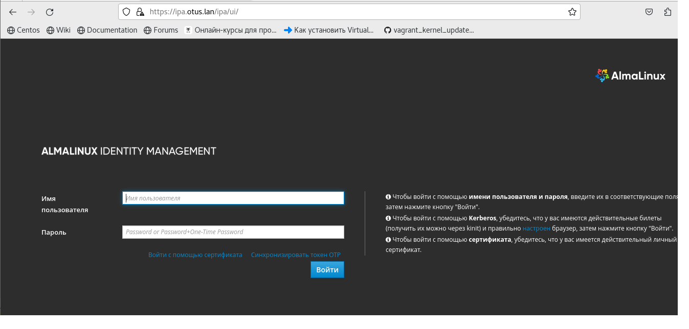
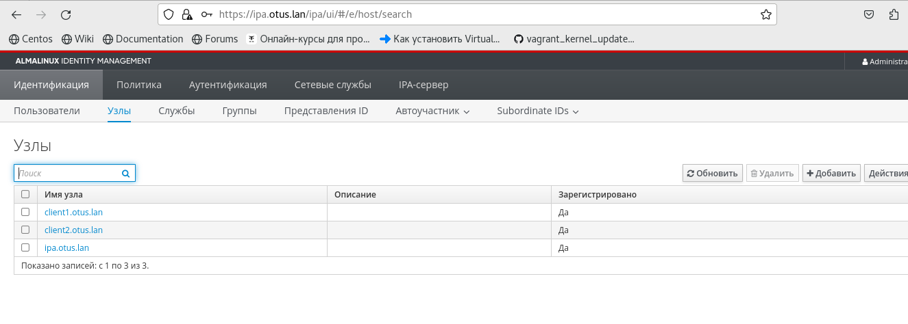

# Домашняя работа: Vagrant-стенд c LDAP на базе FreeIPA


	Цель работы: Научиться настраивать LDAP-сервер и подключать к нему LDAP-клиентов
	Что нужно сделать?

	1. Установить FreeIPA 
    2. Написать Ansible-playbook для конфигурации клиента
	
	Все настройки как сервера так и клиентов проделаем с помощью Ansible.
	
	

  # Выполнение

## Установить FreeIPA .

	Создаем в домашней директории Vagrantfile, собираю стенд на основе almalinux 9.
	Дальнейший разбор настроек будем проводить на примере playbook файлов. Все необходимые файлы конфигурации для настройки
кладём в созданные директории "files" и "templates". 

## Настраиваем сервер IPA - сервер
 
	Создаём фаил ipa.yml и дополняем его tasks(задачами).
	
	Установливаем необходимый софт:
````	
tasks:
    - name: install softs on alma
      yum:
        name:
          - chrony
          - freeipa-server
          - python3-pip
        state: present
        update_cache: true	
````

    Включаем chrony:
	
````	
- name: enable chrony
      service:
        name: chronyd
        state: restarted
        enabled: true
````

	Для правильной работы с логами необходимо настроить время. Мой часовой пояс - Asia/Yekaterinburg. 

Cоздадим задачу настройки тайм-зоны:
```
- name: set timezone to Asia/Yekaterinburg
      timezone:
        name: Asia/Yekaterinburg
````
	Отключаем firewall и seelinux. Для деактивации seelinux в текущей сессии без перезагрузки
выставляем setinforce в ноль:
```
- name: disable firewalld
      service:
        name: firewalld
        state: stopped
        enabled: false

    - name: disable SElinux
      selinux:
        state: disabled

    - name: disable SElinux now
      shell: setenforce 0

    - name: SElinux | Set SElinux config file from template
      template:
        src: files/ipa/config
        dest: /etc/selinux/config
````
	Добавим запись о настраиваемом ipa - сервере в фаил "hosts" :

```
- name: dns | configure dns
      template:
        src: files/ipa/hosts
        dest: /etc/hosts

```
	Для автоматизации ответов на запросы ipa во время настройки задействуем ansible.builtin.expect, 
что в свою очередь требует установки модуля pexpet:
````
- name: Install pexpect
      pip:
         name: pexpect
      become: true 
      
- name: initialize script for ipa
      expect:
        command: ipa-server-install
        responses:
          '(.*)Do you want to configure integrated DNS(.*)': 'no'
          '(.*)Server host name(.*)': 'ipa.otus.lan'
          '(.*)Please confirm the domain name(.*)': 'otus.lan'
          '(.*)Please provide a realm name(.*)': 'OTUS.LAN'
          '(.*)Directory Manager password(.*)': '12080612'
          '(.*)Password \(confirm\)(.*)': '12080612'
          '(.*)IPA admin password(.*)': '12080612'
          '(.*)Password(.*)': '12080612'
          '(.*)NetBIOS domain name \[OTUS\](.*):': 'OTUS'
          '(.*)Do you want to configure chrony with NTP server or pool address\? \[no\](.*):': 'no'
          '(.*)Continue to configure the system with these values(.*):': 'yes'
        timeout: 2400    
````

# Настраиваем и добавляем клиентов на ipa - сервер

	Создаём файлы client1.yml и client2.yml.
Перечисляем в файле задачи использованные при настройке сервера, вместо серверных компонентов используем
клиентские:
	
```
- name: install module ipa-client
    yum:
      name:
        - freeipa-client
      state: present
      update_cache: true
````	
	Добавляем клиентов на ipa-сервер :
````
- name: add host to ipa-server
    shell: echo -e "yes\nyes" | ipa-client-install --mkhomedir --domain=OTUS.LAN --server=ipa.otus.lan --no-ntp -p admin -w 12080612

````	
	Мы можем зайти в Web-интерфейс нашего FreeIPA-сервера, для этого на нашей хостой машине нужно прописать следующую строку в файле Hosts:
192.168.56.12 ipa.otus.lan



	Наблюдаем подключенные узлы:


Работа завершена.


